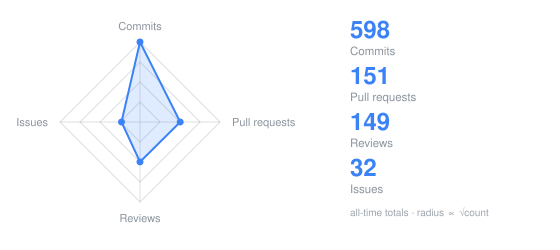
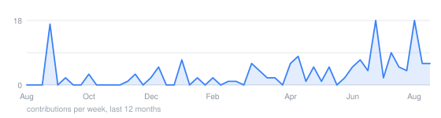

## Thomas Benz

Senior digital design engineer at [lowRISC](https://lowrisc.org), postdoctoral researcher at
[IIS, ETH Zurich](https://iis.ee.ethz.ch).
My 2025 Ph.D. was on energy-efficient, real-time data movement for heterogeneous
mixed-criticality systems.

I design energy-efficient architectures: memory interconnects, data movement, hardware
security, and the ASICs that carry them. So far that adds up to [more than 15 tapeouts](http://asic.ethz.ch/authors/Thomas_Benz.html).
I bring chips up on ATE and standalone setups, which is what
[DUTCTL](https://github.com/pulp-platform/dutctl) is for. Most of what I build is open-source
silicon, all the way down: software, RTL, EDA tools, PDKs.
[Basilisk](https://iis-people.ee.ethz.ch/~phsauter/basilisk/) is one example. I also make
top-metal chip art and high-fidelity GDSII renders with
[ArtistIC](https://github.com/pulp-platform/artistic).

Advising students on their theses is the part I enjoy most. Almost 50 of them so far.

[Publications](https://scholar.google.com/citations?hl=en&user=OjbmkZkAAAAJ) ·
[Ph.D. thesis](https://arxiv.org/abs/2602.09554)

